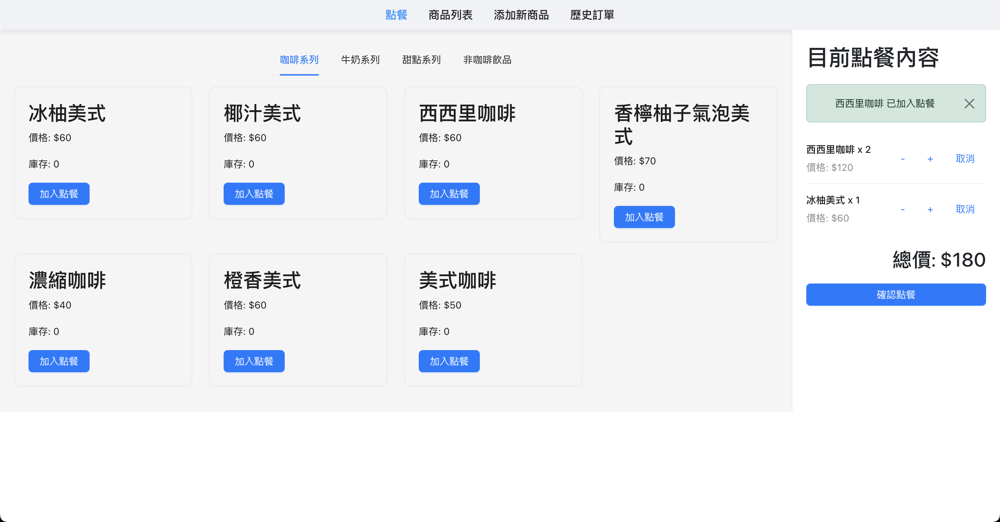
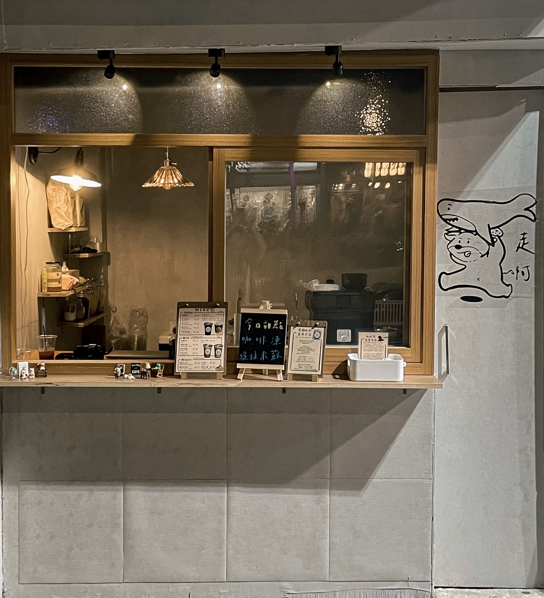

### 點餐系統

某天突發奇想：「既然想開店，為何不現在就開？說不定還沒退休就世界末日了。決心投入之前工作的存款，開一間咖啡外帶店。

這個專案是基於網頁的點餐系統，功能包括新增商品、庫存管理、訂單歷史查看

解決了傳統收銀容易出錯的問題，並能有效管理營收和銷售數據，適合小型店鋪快速部署和運行。

### 功能特點

1. **商品分類和展示**
   - 商品按照類別（例如：咖啡系列、拿鐵系列等）進行分類展示，方便快速尋找和下單。

2. **訂單管理**
   - 用戶可以將商品添加至他們的訂單清單中，總價格會隨著商品增減而更新，可以使用增加和減少按鈕來調整數量。

3. **食譜紀錄**
   - 在確認訂單後，會跳出所選商品的詳細食譜，以免製作過程出錯。

4. **找錢**
   - 用戶輸入客戶支付的金額，系統計算出應找回的零錢。完成支付後，系統會刷新頁面以進行下一次點餐。

5. **庫存管理**
   - 管理員可以新增新商品，更新現有商品信息，確保庫存充足，避免超賣。

6. **訂單歷史**
   - 用戶可以查看過去的訂單，包括訂單時間、訂購商品和總價格等詳細信息，有助於追蹤消費歷史。

7. **輸出交易紀錄**
   - 透過存取特定網頁，能夠取得營運至今的交易紀錄，方便後續使用Power BI進行數據分析。

### 技術堆疊

- **前端：** React.js，使用Bootstrap進行UI設計
- **後端：** Spring Boot（Java）
- **資料庫：** PostgreSQL
- **部署：** Heroku

### 功能亮點

- **響應式設計：** 使用Bootstrap確保在不同設備上的兼容性和響應式設計。
- **RESTful API：** 後端提供REST端點，支持前後端之間的無縫通訊，支持CRUD操作。
- **資料庫整合：** 使用PostgreSQL存儲產品信息、訂單詳情和交易記錄。
- **可攜性：** 在Heroku上部署，確保系統在任何地點、平台上的可用性。

這個點餐系統不僅通過直觀的界面增強了用戶體驗，還通過其豐富的功能和強大的技術堆疊支持對食品銷售和客戶行為的高效管理和分析。
